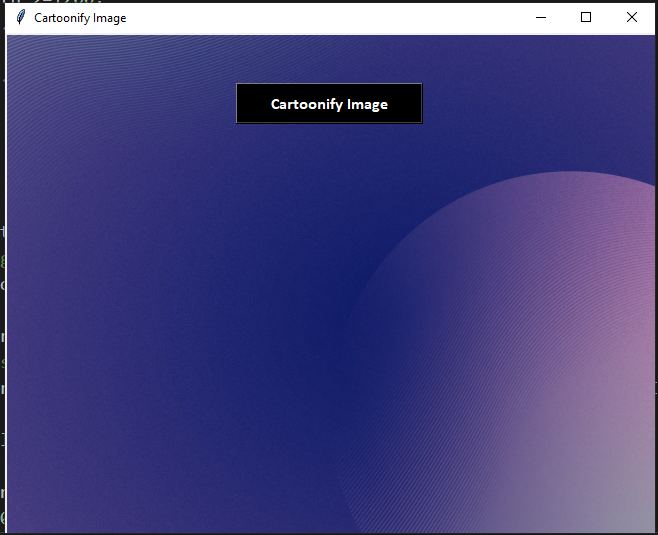
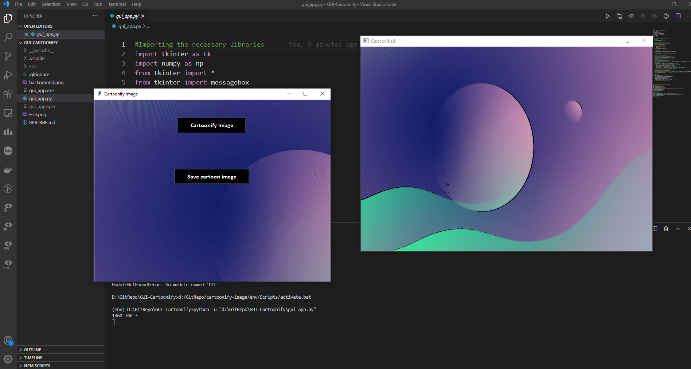

## GUI-Cartoonify

### How to set up locally?

As I have uploaded the venv file,there is no requirement of setting up any virtual env anymore/activating it.The virtual env will automatically activate if you clone the repository in the local.


Dependencies:

```
- opencv-python
- tkinter
- easygui
- pillow
```

### GUI Interface
-----


### Example
-------

